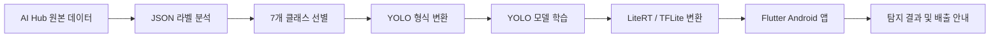

<div align="center">

# ♻️ 분리ON

### 딥러닝 기반 생활폐기물 인식 및 분리배출 안내 서비스

사진 속 생활폐기물을 탐지하고 품목별 배출 방법을 안내하는 Flutter Android 앱


</div>

---

## 프로젝트 개요

| 구분 | 내용 |
|---|---|
| 목표 | 생활폐기물 자동 탐지 및 올바른 분리배출 정보 제공 |
| 데이터 | AI Hub 생활폐기물 이미지 데이터 |
| AI | YOLO 계열 객체 탐지 모델 학습·비교 |
| 앱 | Flutter 기반 Android 애플리케이션 |
| 온디바이스 추론 | LiteRT/TFLite 모델 탑재 |
| 지원 품목 | 플라스틱류·종이류·음료수곽·유리병류·캔류·비닐류·스티로폼류 |

## 핵심 기능

- 카메라 촬영 이미지 분석
- 갤러리 이미지 불러오기 및 분석
- 탐지 객체 바운딩 박스 표시
- YOLOView 기반 실시간 탐지
- 품목별 분리배출 가이드 제공
- 인식 기록 저장 및 결과 다시 보기
- 모델 신뢰도 임계값 설정

## 처리 흐름



## 데이터 구성

- 원본 라벨 수
  - Training: `609,927`
  - Validation: `76,377`
- 라벨 형식 변환
  - AI Hub JSON → YOLO Detection
  - BOX 좌표 우선 사용
  - Polygon 좌표의 Bounding Box 변환 지원
  - 해상도 기준 좌표 정규화
  - 누락 이미지·잘못된 좌표·변환 오류 로그 생성

| ID | 탐지 클래스 |
|---:|---|
| 0 | 플라스틱류 |
| 1 | 종이류 |
| 2 | 음료수곽 |
| 3 | 유리병류 |
| 4 | 캔류 |
| 5 | 비닐류 |
| 6 | 스티로폼류 |

## 모델 학습

- Ultralytics YOLO 기반 객체 탐지
- 입력 크기 `640 × 640`
- Weights & Biases 학습 이력 관리
- 학습 중간 결과 및 체크포인트 저장
- 학습 모델의 LiteRT/TFLite 변환 및 모바일 탑재

주요 스크립트:

```text
convert_aihub_to_yolo_detection_v3.py  # AI Hub → YOLO 데이터 변환
count_details_structure.py             # 원본 라벨 구조 및 클래스 집계
check_yolo_samples.py                  # 변환 데이터 샘플 검증
train_yolo_wandb.py                    # YOLO 학습 및 W&B 기록
resume_yolo26_wandb.py                 # 중단 학습 재개
```

## 앱 구조

```text
bunrion/
├─ lib/
│  ├─ app/                  # 라우터·테마·전역 Provider
│  ├─ core/                 # 품목 상수·공통 유틸
│  ├─ data/                 # 분리배출 가이드 저장소
│  ├─ features/
│  │  ├─ camera/            # 사진 촬영
│  │  ├─ detection/         # 분석 및 결과 화면
│  │  ├─ live_detection/    # 실시간 탐지
│  │  ├─ dictionary/        # 품목 사전
│  │  ├─ history/           # 인식 기록
│  │  └─ settings/          # 설정
│  └─ services/
│     ├─ model/             # LiteRT/TFLite 추론
│     └─ storage/           # 로컬 기록 저장
├─ assets/
│  ├─ data/                 # 분리배출 가이드 JSON
│  └─ models/               # 앱 내장 TFLite 모델
└─ test/                    # 데이터·모델·화면 테스트
```

세부 앱 문서: [`bunrion/README.md`](bunrion/README.md)

## 실행 방법

요구 환경:

- Flutter SDK
- Dart SDK `^3.11.1`
- Android SDK 및 연결 기기 또는 에뮬레이터

```bash
cd bunrion
flutter pub get
flutter run
```

Android debug APK 빌드:

```bash
flutter build apk --debug
```

빌드 결과:

```text
bunrion/build/app/outputs/flutter-apk/app-debug.apk
```

## 검증 상태

- [x] 사진 촬영 및 갤러리 분석
- [x] 탐지 결과 바운딩 박스 보정
- [x] 품목별 분리배출 안내
- [x] 인식 기록 저장 및 다시 보기
- [x] 실시간 탐지 화면
- [x] Android debug APK 빌드
- [x] `flutter analyze`
- [x] `flutter test`

## 기술 스택

| 영역 | 기술 |
|---|---|
| Data & AI | Python, Ultralytics YOLO, Weights & Biases |
| Mobile | Flutter, Dart, Android |
| On-device AI | LiteRT/TFLite, YOLOView |
| State & Navigation | Riverpod, go_router |
| Device & Storage | camera, image_picker, shared_preferences |

## 공개 범위

- 현재 비공개 저장소
- AI Hub 원본 데이터 및 대용량 학습 산출물 제외
- 앱 실행에 필요한 TFLite 모델 포함

---

<div align="center">

[GitHub 프로필](https://github.com/LeeMS0122) · [Notion 포트폴리오](https://cake-oviraptor-b43.notion.site/314eefba1b6d81538fe2f56c4adb52b9)

</div>
